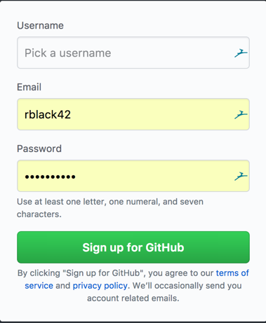

HW 1: GitHub Setup
##################

..  include::   /header.inc

:Due Date: Saturday, Jan 26.

..  note::

    After you complete this assignment, email your github_ user name to me
    at rblack@austincc.edu. Be sure to include "HW1" in the subject line to
    receive credit. This is the only assignment you will submit by email!

Prerequisites
*************

Before you can get any work graded for this course, you must set up a personal
account on GitHub_. This is a free service that hosts millions of
:term:`open-source` projects. As a software developer, this is an incredible
resource, one you should explore  often when looking into how to use a new
language, or developer's tool. It is a place to see examples of outstanding
code, and terrible code. Exploring this site can make you a better programmer.

..  warning::

    NEVER submit any code to me that you copied directly from GitHub_ or any
    other source, including other students in this class. . Doing so will
    result in a grade of zero for that assignment. If the infraction occurs
    more than once, you will automatically be issued a grade of zero for the
    course.

Part 1: Create your account
***************************

    1.  Navigate to GitHub_ using your favorite web browser.

    2.  Find the sign-in panel that looks like this:

    3. Enter a unique user name.

..  warning::

    This name is something a potential employer will see when they consider you
    for a job. Do not pick a name that will embarrass you in that situation. You
    may regret that name later. YMMV!

    4.  Enter a suitable email address. I recommend that you use your ACC email
        address.

    5.  Pick a password you can remember.

To complete this assignment, email your user name to me!

Part 2: Create a Homework Repository
************************************

In this step, you will be creating a directory (folder for you Windows folks)
where all homework assignments will be "submitted". Actually, submitting any
assignment in this course will involve making sure your work shows up on
GitHUb_. Exactly how you will do that is something we will go over in class.
For now, just follow along.

Make sure your GitHub_ account is set up, then click on the following link:

..  warning::

    Make sure you click on the link for your section!

        * `COSC2325-003 <https://classroom.github.com/a/BFFB0hDe>`_

        * `COC2325-004 <https://classroom.github.com/a/XGhAF7wK>`_

GitHub_ calls this link an "invitation". Basically, you are agreeing to work on
a project, and GitHub_ will create a custom repository for you on their server.
The project folder will have a name that includes your GitHub_ user name. The
project will be in a folder on their server, and you can see this folder by
navigating to a URL that looks something like this:

    * https://ACC-COSC2325-004-SP19/homework-username

..  note::

    Use your section number on the link, and your GitHub_username.

The folder GitHub_ creates for you will be empty. However, it will be set up to
be managed by Git_. You will need to "clone" a copy of this folder onto your
development workstation to get set up to submit homework for this class. We
will go over this in class, but basically, you will be doing this from a
command line prompt:

..  code-block::    bash

    cd cosc2325
    git clone https://github.com/ACC-COSC2325-003-SP18/homework-username.git

You will end up with a new folder on your machine named ``homework-username``.
You will be working inside that folder when you work on homework problems.

For now, I want you to create a simple text file in this new homework folder.
The file needs to be located directly inside the homework folder and must be
named ``README.rst``. Place this text in this file:

..  code-block:: text

    COSC2325 Homework Projects
    ##########################
    :Author: First Last
    :Term: Spring 2019
    :Instructor: Roie R. Black
    :School: Austin Community College

    This repository holds all homework assignments for this class.

Once this gill has been saved on youtr system, do these three steps:

..  code-block:: bash

    $ git add README.rst
    $ git commit -m "Added README file"
    $ git push origin master

On that last step, you will be asked for your username and password on GitHub_.
Git_ will transmit a copy of this new file to the GitHub_ server and you should
see this file on their system using your web browser.

If you see the README file using your web browser, you have successfully
started doing development work using Git_. You joined a gigantic community of
developers all doing the same thing every minute of every day. Wow!

Now, make sure you send off that email to me, and you are done!

..  vim:ft=rst spell:
