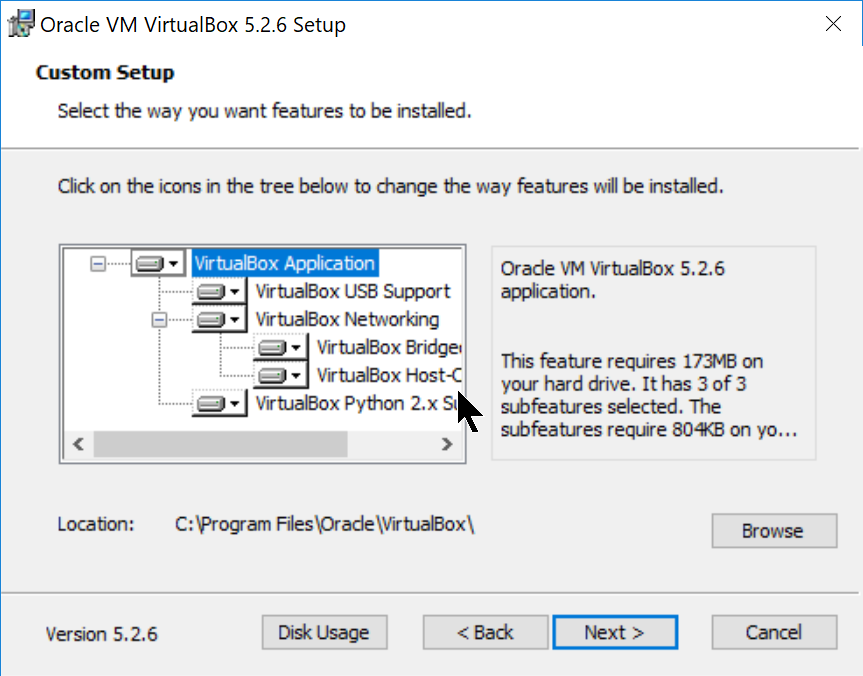
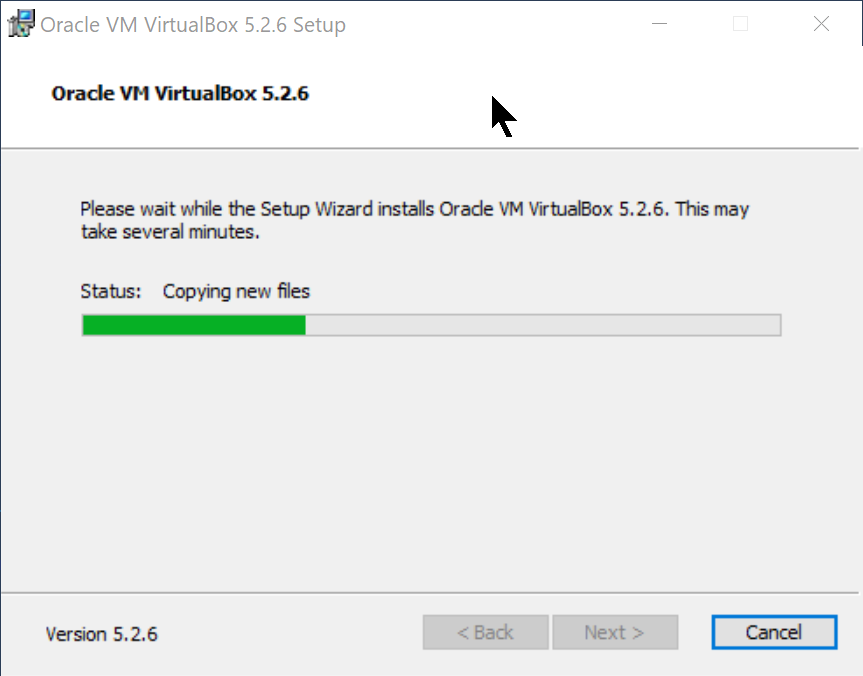

Setting Up a Virtual Machine
############################

..  include::   /header.inc

We will be working in Linux for this class, and since most of you do not have
Linux running on your chosen development system, we are going to use an
important tool in the development world: a :term:`virtual machine`. 

Basically, a :term:`virtual machine` is just a program designed to act like a
real computer. There are several possible such engines available:

    * VMware_ - used in our labs (a commercial product available on all
      platforms)

	* VirtualBox_ - a free tool from Oracle (which we will use here)

	* Parallels_ - a commercial product for Mac

VMware_ seems to be the most advanced engine, but it is complex. There is a
free version of this product, which is what is installed on lab machines. I
prefer to use the VirtualBox_ engine these days. 

..  note::

    If you are not sure that your machine can run a :term:`virtual machine`,
    download this application

    * :download:`/files/VMware-guest64check-5.5.0-18463.exe`

    Running this (on a Windows system) will tell you if your hardware is
    suitable for this course. If not, see me immediately and we will set you up
    on a Rackspace_ server that you can use for your work. Note that in this
    case, you will not have access to the GUI applications, just a simple
    command line environment.

    Also, just because this tool tells you that your processor can run a VM,
    does not mean everything is fine. You may need to get into the BIOS on your
    system and set it to allow VM tools to run. See me for help with this,
    since what you need to do depends on your system!

To install VirtualBox_ on a PC or Mac, you need to navigate to the product
website and download the correct installer. I am going to demonstrate
installing this tool on my Windows 10 system.

Here is the link I used to get the Windows installer:

    * `VirtualBox-5.2.6-120293-Win.exe
      <https://download.virtualbox.org/virtualbox/5.2.6/VirtualBox-5.2.6-120293-Win.exe>`_

Launch this program by double-clicking on the program file name in ``Windows
Explorer``:

..  image:: images/VBinstall1.png
    :align: center
    :width: 600

Click on "next" to proceed.

You can accept the default location for this program. Click "Next" to continue

Again, the defaults are fine. Click "Next" to continue.

Here, the installer is warning you that you might lose access to the Internet
during the installation. No streaming video should be going on! Click "Next" to
continue.

Now, we are ready to install the program. Click "Install" to continue.

At this point, the installation will begin. The installer will copy files into
place. You will probably see this pop-up during the process. 

..  image:: images/VBinstall7.png
    :align: center
    :width: 600

Click on "Install" to let drivers be installed.

..  image:: images/VBinstall8.png
    :align: center
    :width: 600

The installation should complete with no problems. Click on "Finish" when this
screen appears.

Installing Linux on Your VM
***************************

Now that you have VirtualBox_ installed, we need to create a real ``virtual
machine`` running Linux. 

..  warning::

    This is going to take some time, since the file you need to download is
    about 1.8 GB. To save some time, I will place this file on your "I" drive,
    which you can access from a school lab machine.

We will be using a desktop version of Ubuntu_ Linux to run software for this
course. The :term:`VM` will be a 64-bit system, meaning that you need to set
this up on a system with a suitable 64-bit processor. 

Download the OS
===============

We start off by downloading the operating system from the Ubuntu_ website. The
version we will be using is 18.04 LTS, meaning that it will be supported for at
least five years. We will be installing the desktop version, complete with a
GUI, but you are free to use the console-only server version which will let you
simulate working on a remote server.  

This is the file you can use to set up your machine:

    * `ubuntu-18.04.1-desktop-amd64.iso
      <http://releases.ubuntu.com/18.04.1/ubuntu-18.04.1-desktop-amd64.iso>`_

Installing the OS
=================

Start off by starting VirtualBox_

..  image:: images/usetup1.png
    :align: center

Click on the "New" button at the top of the screen. We are going to build a new
computer, and not give any money to Fry's!

..  image:: images/usetup2.png
    :align: center

 
In this screen, we name our machine. The name I picked makes it obvious to me
which class this is for. (I have several VM machines set up for all kinds of
purposes!)

The first thing to do is decide how much memory we are going to allocate to
this machine when it is running. You need to be careful here, since if you give
the VM too much memory, your host machine will slow down!

I usually use one to two gigabytes for Linux VM machines, more for a Windows VM!. If your machine has 4GB of RAM, stick with 1GB here. My laptops all have 8-16GB of RAM so I set mine to 2GB.

Click on "Create when you are done with this page.

..  image:: images/usetup3.png
    :align: center

On this screen we decide how big our virtual hard disk will be. There is no
need to go crazy here, this is not a place to load up video or music files.
Instead only add things you need for the intended use of this VM. We are going
to do C++ development in this machine. Since we are setting up a VM with a GUI
interface, I use 20GB for the hard disk size. 

..  note::

    That 20GB size for the "Disk Image is not how big the virtual disk file
    will be  when you start, it is how big it can grow to if you install lots
    of stuff! (We will not be doing that for this class, 

Click on "Create" to continue.

..  image:: images/usetup4.png
    :align: center

You now have a new computer to play with. However, it has no operating system
now. There are a few more hardware changes we need to make as well. 

Click on the "Settings" menu item.

This window has a lot of options you can explore. There are a few standard
things I do with my VM setups.

Click on the "Display" menu item:

Since we are using a GUI interface here, we need to tweak the video system a
bit.

I raise the amount of video memory to that max value, 128MB. This is not a
gaming video system, but we will be doing a bit of graphics work in our lab
projects.

..  note::

    The Dell laptop I use to PC development work has a high-resolution screen,
    with over 3000 pixels across the screen. When I set up a VM with the
    default settings, the VM window was tiny, and the text was barely readable.
    I raised the "Scale Factor" to 200% and the result was readable. I would
    try running with the default settings, and experiment with this setting if
    things seem too small. (This is the first machine I have had this problem
    with!)

    Note also that I tried to turn on "2D Video Acceleration" but got the
    "Invalid settings detected" message. I actually turned that off after this
    screen shot.

Next, click on the "Shared Folders" menu item.

We will add a folder on your host machine and "map" that folder into the VM.
This is extremely handy when you want to copy files between the host and the
VM:

Right-click on the "Machine Folders" item in this screen. Select "Add Shared
Folder": :

..  image:: images/usetup8.png 
    :align: center

I created a folder on my PC where I will put files to be shared. The settings
you see here reflect that folder on my system. You can map any folder on your
host system that you like. The "Folder Name" is the name that folder will have
on the VM file system. We will talk more about this setup in class (after I
test things a bit on my new Dell!)

Click on "OK" to continue.

Next, click on the "Storage" menu item:

..  image:: images/usetup9.png
    :align: center

Now, we need to set up the DVD so we can install Ubuntu_!  Note the "Empty"
line next to the icon that looks like a DVD. 

Click on the line with "Empty". You will see a new window on the right.

On the line that says "Optical Drive", click on the DVD icon on the far right,
and choose "Choose Virtual Optical Disk File". Navigate to the ISO file you
downloaded (or copied from the "I" drive) and click on "Open". Once this is
selected, click on "OK'. This should return you to the settings menu.

..  image:: images/usetup11.png
    :align: center

Click on "OK" again, and you should be back on the main VirtualBox_ control
panel. 

At this point, you are ready to fire up your new machine, and let the OS
install. Click on "Start" to power up your new machine. Since we have set up a
virtual DVD with the OS installer in it, your machine will boot from that DVD. 

..  note::

    I missed on screen in building these notes. The installer will offer to
    "Try Ubuntu", or "Install Ubuntu". We want to install it. 

    It will also tell you that it will erase your hard drive and everything on
    it. Do not worry, that message is talking about the Virtual Hard Drive in
    the VM machine, not your host machine. This is totally safe.

The next few screens should be fairly obvious. The default settings are fine,
so just click on "Continue" to move forward.

..  image:: images/usetup12.png
    :align: center

Unless you really want to use some foreign language keyboard, choose English here.

Assuming your host is connected to the Internet, it is best to allow updates to
be installed as this process continues. These are the settings I used.

Here is where that scary message about erasing your hard disk is seen. Press
on! Click on "Install Now".

Another scary screen, just press "Continue"

Here you set your time zone. The installer should have detected the correct
choice. Austin is not allowed, so Chicago is the right choice for us.

..  image:: images/usetup17.png
    :align: center

On this screen, you set up the default user account. Pick a user name you like,
and enter a password (twice). The name on your computer will show up on command
lines, so keep it short.

..  image:: images/usetup18.png
    :align: center

When you get here, the installer will plug away installing everything. This
will take a few minutes to complete. 

..  image:: images/usetup19.png
    :align: center

When the installer completes, you will see this screen. It is time to reboot
the system and see Ubuntu_!

..  warning::

    I actually had some problems getting this system to boot up. It took about
    three tries before it successfully booted up. I need to research why that
    happened. Let me know if you experience anything similar. Once I got it
    started, the problem went away. 

..  image:: images/usetup20.png
    :align: center

This screen wants you to uninstall the installer DVD. On my system, VirtualBox_
did that for me. 

..  note::

    If you seem to get right back into the installer setup, let me know. You
    need to shut down the VM, and remove the DVD from the VirtualBox_ control
    panel if this happens.

This is what you want to see before starting up the VM for real work.

And this is your first look at Ubuntu Linux, running in your :term:`virtual
machine`! Click on the "Next" item at the top to get rid of this startup
stuff.

We need to run one command on this new system before we can continue. Click on
that funny grid of dots at the lower-left of your screen, then move to the
second screen by clicking on the lower check box on the right. .

Click on the "Terminal" icon. This will start up the terminal program so we can
issue a command.

..  image:: images/usetup26.png
    :align: center

This is where we will do a lot of work. You might take a moment, and clean up
things here. I usually delete the icons on the left side of this screen by
right-clicking on icons I do not want and selecting "Remove from Favorites.
When I see the icon for the Terminal program, I right click and select "Add to
Favorites. Remember, this is a work machine, so I keep things focused on the
work I intend to do. I will "play" on my host machine.

Type in this command. It will install the C++ compiler and other development
tools we need.

The "sudo" stands for "Super-User DO". It is Linux's way of saying "I need more
power!". The super-user has the power to destroy the machine, so we wield that
power carefully. Here, we need to install tools in protected system folders, so
we need this level of control. As the default user of this machine, you have
the power! Enter your login password to continue.

..  image:: images/usetup29.png
    :align: center

Personally, I hate white text on a dark background. If I print screen shots,
they eat up a lot of black ink! Also, that kind of screen is hard to read when
I project something in a classroom. You can change things by clicking on "Edit
-> Preferences" at the top of the terminal window. Here I clicked on the
"Colors" tab and make some changes. Feel free to explore settings. It is you
who will be looking at this screen. Make it nice for you! (I may yell at you
if you bring your machine to me for help and I cannot read the thing, though.
YMMV!)

Install Guest Additions
***********************

We have one last step to perform. VirtualBox_ (and VMware_ as well) provide
packages that tune up your :term:`virtual machine` to run more efficiently on
your operating system. To add these now, we need to have the VM running.

At the top of your screen, you should see a VirtualBox_ menu line. Click on the
one labeled "Devices". At the bottom of the pop-up window it will say "Insert
Guest Additions CD". Select this.

When you see this window, select "Run". (You will probably see that password
pop-up showed earlier here!) Once this completes, you have a usable VM. We will
go over additional setup steps in class. 

Welcome to your first :term:`virtual machine`! You will find them a great way
to explore new operating systems, and try new things without tworrying that you
will toast your host machine. On one of my Mac systems, there is very little
software installed, everything I do on that machine is in a custom VM tuned to
the project I am working on at the moment. The cool thing about this setup is
that when I do not need a VM, I copy the entire thing to an external hard
drive, and roll it back onto my system (or another system) later, when I need
it again!

Later in the course, I will introduce you to an even cooler VM tool. Stay
tuned!

..  vim:ft=rst spell:

