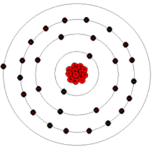

The Nature of Electricity
#########################

:Reference1: https://www.physicsclassroom.com/class
:Reference2: https://electronics.stackexchange.com/questions/73998/how-antenna-radiateshow-currents-flows-through-wire

Computers are electical gadgets. That should be obvious, since we need an
electrical power source of some kind to make them do anything. If that power
source goes away, a computer is a useless pile of physical stuff that can be
used as a door-stop!

Once we add that power source, magic starts to happen.

Power Source? 
*************

We power our computers either with a battery, or by plugging it into a wall
socket. In either case, that power source provides a pile of electrons that can
move through our computer.

Electrons
=========

So what is an electron?

This is not a Physics course, so we will not dig too deeply into electricity
here. Basically, an electron is a tiny particle that carries a negative
electrical charge. There are other kinds of particles in our universe,
including protons, which carry a  positive electrical charge (opposite from
that carried by an electron), and neutrons, which carry no charge at all.

Atoms
=====

Atoms are made up of these three fundamental particles. In general any material
is made up of a bunch of atoms, each identical in structure:

    * Some number of neutrons

    * Some number of protons

    * Usually the same number of electrons as we have protons.

The neutrons and protons are glued together in a mass called the nucleus of the
atom. The electrons swarm around that nucleus in a cloud. The best way to
visualize this is to compare it to our solar system. The nucleus is the Sun,
and the electrons are like the planets orbiting around the sun. The big
difference is that electron orbits do not resemble a typical picture of our
planets that much. Instead electrons live in one of several "shells" each of
which contains a number of electrons all spinning around at some common speed.
Their "orbits" are not nicely laid out like our planets are.

These shells are called electron shells. The outermost shell is called the
valence shell, and that is where electrons live that can can interact with the
electrons from other atoms if they get close enough together.

Here is a picture of a copper atom:

Copper atoms have this structure:

	* Core consisting of

		* 34 neutrons
		* 29 protons
	* Electron cloud with 29 electrons

The electrons we are interested in tend to hang out near those outer rings
called valence rings, rather than in orbits closer to the center. It takes
energy to move an electron from one ring to another, and more energy to knock
an electron loose from an atom.

Free Electrons
==============

Some atoms will tolerate extra electrons which can hang out on that outer ring.
These electrons are not as tightly bound to the atom, and they can move around
between atoms more easily. We call these "free electrons" and they are really
what is moving around when we talk about electricity!

But the action is not what you might expect.

One analogy I saw was pretty interesting. Pretend that these free electrons are
sitting in a tube like marbles packed together in that tube. The atoms are as
close together as they can get. If we push one free electron into the end of the
tube, one will need to pop out of the other end to make room. Just as would be
the case if we were playing with marbles. (Wait, I seem to have lost a marble
somewhere!)

We see an electron pop out at the other end as a result of pushing a new on in.
All of the electrons in the tube only moved a small amount, but we see the
action immediately on the other end. Wow! Cool stuff!

Clueless Atoms
==============

Just as we discussed when talking about our digital gadgets, atoms have no clue
what is going on around them. They just sit there watching over their private
swarm of electrons. If a few free ones come by and seems to stick around, the
atom is more than happy to pitch them away, so some other atom can deal with
them. 

This idea led me to wake up in the middle of the night with a game idea we can
play to show how electricity flows.

Are you ready?

Let's Dance!

